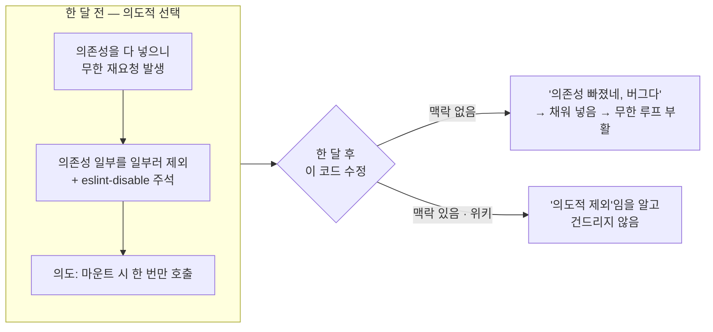
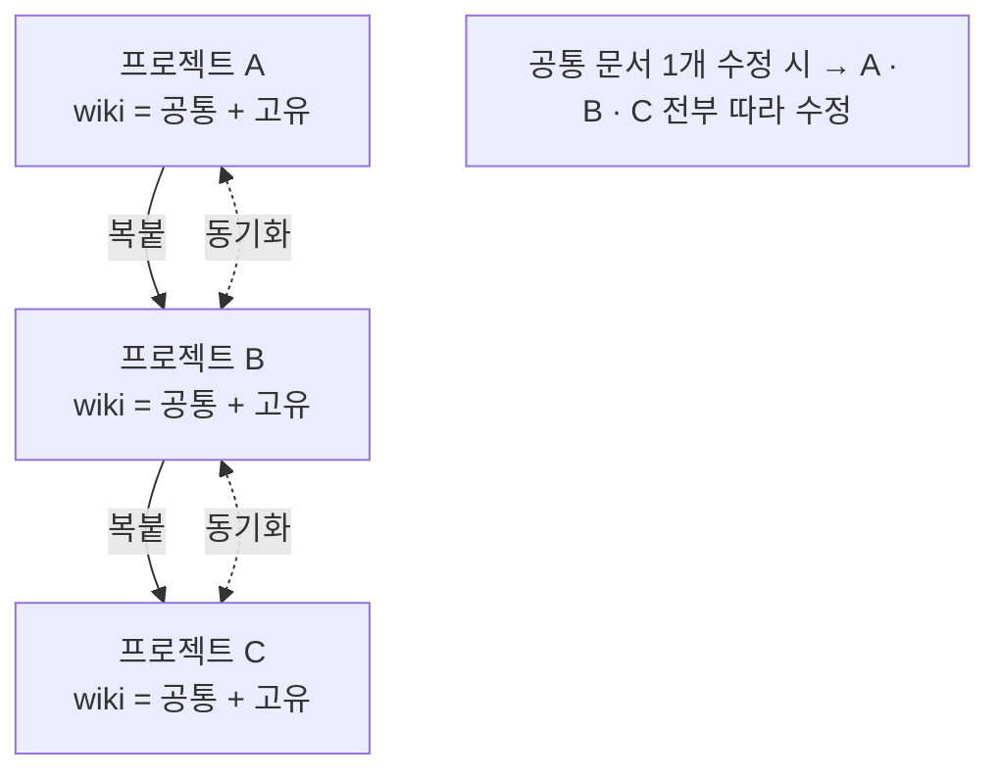
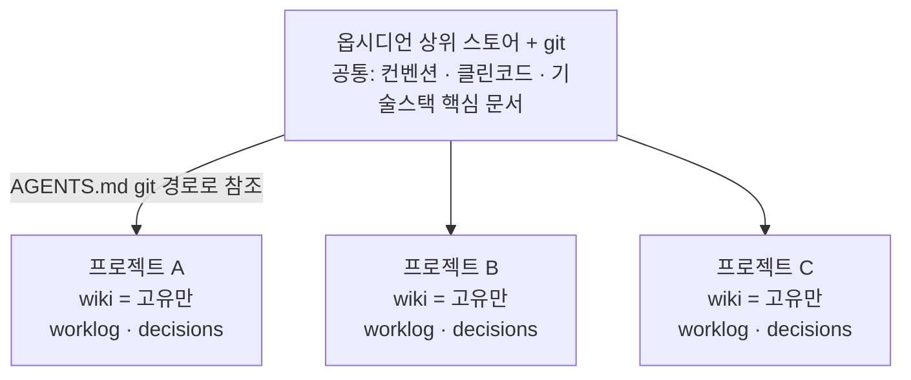
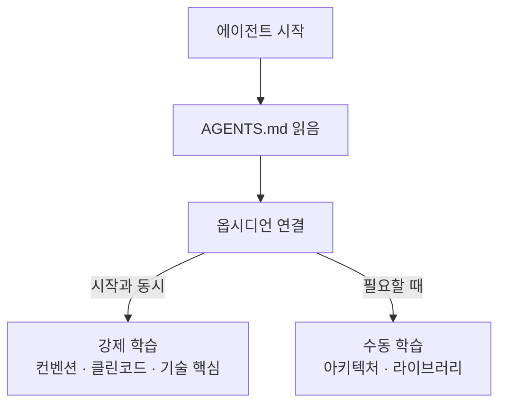

# LLM Wiki와 옵시디언으로 프론트엔드 작업 자동화하기

## 한 줄 요약

프로젝트마다 따로 관리하던 AI용 문서를, 공통 지식은 옵시디언 상위 스토어로 올리고 프로젝트 고유 기록만 각 저장소에 남기는 구조로 바꿨다. 그 결과 에이전트가 매번 맥락을 다시 학습하지 않고 작업을 이어갈 수 있게 됐다.

## 시작은 컨텍스트 엔지니어링의 한계였다

원래는 하네스 엔지니어링, 컨텍스트 엔지니어링으로 개발했다. 두 방법 모두 결국 한 가지를 향했다. AI에게 줄 컨텍스트를 핵심만 잘 다듬는 것.

그런데 반대 방향으로 가면 문제가 생겼다. 한 파일에 정보를 다 밀어 넣으면 오히려 성능이 떨어졌다. 컨텍스트 토큰을 과하게 소모했고, 의도하지 않은 결과물이 나왔다. 많이 넣을수록 좋아지는 게 아니라는 게 분명했다.

(이후 "학습시킨다"는 표현은 모델을 재학습한다는 뜻이 아니라, 필요한 문서를 컨텍스트에 넣어 참조하게 한다는 의미로 쓴다.)

## LLM Wiki라는 개념

그 와중에 안드레이 카파시가 제안한 LLM Wiki를 알게 됐다.

LLM Wiki는 하나의 지식 저장 아카이브다. 필요한 데이터를 적재적소에 꺼내 쓰는 구조다. 그리고 그 데이터는 개발 문서에만 국한되지 않는다. 회의록, 어떤 작업을 했는지에 대한 기록까지 문서로 정리할 수 있다.

엄밀히 말하면 LLM Wiki도 컨텍스트 엔지니어링의 일종이다. 다만 모든 걸 미리 한 파일에 욱여넣는 대신, 필요한 문서를 그때그때 꺼내 컨텍스트에 넣는 retrieval 방식이라는 점이 다르다. 앞에서 겪은 "한 파일에 다 넣기"의 한계를 푸는 방향이 바로 이것이었다.

여기서 LLM Wiki의 진짜 장점이 보였다. **에이전트가 맥락을 이해할 수 있게 된다는 것**이다.

## 핵심은 "맥락 복원"이다

이전에는 전날 작업을 다시 학습시키려면 `git diff`를 보게 하거나, 이전 세션을 compact한 뒤 다시 학습시켜야 했다. 이 방법으로 어느 정도는 커버됐다. 하지만 며칠, 몇 주, 몇 달 전 작업을 다시 끌어와 학습시키는 건 무리였다. 그렇다고 안 하면 매번 처음부터 다시 가르쳐야 했다.

예를 들어 보자.

어떤 컴포넌트에서 `useEffect` 의존성 배열에 값 하나를 일부러 뺐다고 하자. 그 값이 바뀔 때마다 재요청이 돌아 무한 루프가 났고, 마운트 시 한 번만 호출하려고 의도적으로 뺀 것이다. `eslint-disable` 주석까지 달아 뒀다.

한 달 뒤 누군가(에이전트든 나든) 이 코드를 본다. 맥락이 없으면 자연스럽게 "의존성이 빠졌네, 버그인가" 하고 채워 넣기 쉽다. 그 순간 한 달 전에 막아 둔 무한 루프가 되살아난다. 하지만 "이 값은 의도적으로 제외했고, 넣으면 루프가 돈다"는 기록이 있으면 건드리지 않는다.

맥락 복원의 진짜 가치는 여기 있다. 단순히 다시 파악하는 시간을 아끼는 게 아니라, **과거의 의도적 선택을 미래의 선의의 수정이 되돌리는 사고를 막는 것**이다.

이 효과 때문에 LLM Wiki를 파기 시작했다. 카파시의 폴더 구조부터 문서 정리 방법, 정리 툴까지. 그러면서 생각이 하나로 모였다.

> LLM Wiki는 대량의 아카이브다. 에이전트는 이곳을 탐색해 필요한 정보를 빠르게 학습하고, 처음부터 다시 시작해도 방금 하던 것처럼 이어갈 수 있다.

## 첫 시도와 실패: 프로젝트 root에 wiki

처음에는 프로젝트 root 폴더 안에 wiki를 만들었다. 이게 나중에 큰 문제가 됐다.

문제는 두 가지였다.

- **복붙과 후처리.** 다른 프로젝트를 시작하면 wiki를 복사해 와야 했다. 그리고 그 프로젝트에서만 쓰던 내용은 빼야 했으니 후처리가 따라붙었다.
- **동기화 리스크.** A 프로젝트의 공통 컨벤션 문서가 업데이트되면 B에도 같은 수정을 반영해야 했다. 공통 문서가 늘수록 이 운영 비용은 계속 커진다.

## 구조를 다시 짠다: 공통은 위로, 고유는 아래로

해결 방향은 분명했다. 공통적인 내용은 상위 스토어에서 관리하고, 각 프로젝트에서만 쓰는 문서는 그 프로젝트 안에 둔다.

상위 스토어는 옵시디언으로 정했다. 공통 문서를 옵시디언에 정리하고 git과 연결한다. 특정 프로젝트를 시작할 때 `AGENTS.md`에 이 git 경로를 추가해서, 에이전트가 옵시디언을 탐색할 수 있게 한다.

이렇게 하면 공통 문서는 옵시디언 한 곳만 고치면 된다. 복붙도, 동기화도 사라진다.

## 강제 학습과 수동 학습

여기서 한 발 더 나갔다. **강제 학습 / 수동 학습**을 나눴다.

이게 가능한 이유는 에이전트 코드들이 `AGENTS.md`를 읽기 때문이다. 옵시디언이 `AGENTS.md`에 연결되는 순간, 특정 핵심 문서는 바로 학습하게 만들 수 있다.

- **강제 학습** — 필수 컨벤션, 클린코드, 각 프로젝트가 쓰는 기술스택의 핵심 문서. 시작과 동시에 주입한다.
- **수동 학습** — 파일 아키텍처, 라이브러리 사용법 같은 건 필요할 때 해당 문서를 우선 보게 한다.

전부 주입하지 않는 게 핵심이다. 처음 겪었던 "한 파일에 다 넣으면 성능이 떨어진다"는 문제로 다시 돌아가지 않으려는 선택이다.

## 프로젝트 위키: 작업과 결정의 기록

이 상태에서 각 프로젝트에도 wiki를 쓴다. 다만 여기는 기술 문서가 아니라 **작업과 결정**을 기록한다.

- `worklog.md` — 커밋마다 어떤 작업을 했는지 기록한다.
- `decisions/` — 일정마다 어떤 결정이 오갔는지 기록한다.

이러면 "저번 주에 뭘 결정했지?"라고 물었을 때, 에이전트가 그 문서를 참조해 작업 맥락을 이어간다. 공통 지식(옵시디언)과 프로젝트 맥락(프로젝트 wiki)이 역할로 분리되는 구조다.

## 적용 결과

실제 사이드 프로젝트에 적용했다.

정량 측정은 하지 않았다. 그래서 수치로는 못 적는다. 다만 체감으로 달라진 건 분명하다. 코드 일관성이 안정됐고, 작업 시작이 빨라졌다. 무엇보다 PR 작성법, 커밋 방법, 코드 스타일을 매번 따로 학습시키지 않아도 됐다. 상위 스토어 위키에서 공통으로 보기 때문이다. 그래서 개별 프로젝트에 `docs/`를 따로 만들지 않고도 작업이 굴러갔다.

## 아직 풀어야 할 숙제

이 방식이 완성형은 아니다. 트레이드오프가 있다.

- **탐색 비용.** 더 빠른 문서 탐색을 위한 그래프 탐색이 필요하다. 정확하면서도 적은 토큰으로 검색하는 기능이 아직 없다.
- **초기 주입량.** 강제 학습 문서가 많아지면 초기 컨텍스트 토큰이 과해질 수 있다. 강제/수동 학습으로 줄이긴 했지만, 처음 겪은 문제와 같은 함정이 남아 있다.

그럼에도 일관된 코딩과 빠른 결과물 때문에, 지금은 이 방식이 더 낫다고 본다. 더 좋은 개념이 보이면 그때그때 연구해서 도입하고 개선할 생각이다.

## 결국 AI는 도구다

AI는 도구일 뿐이다. 하네스 엔지니어링, 컨텍스트 엔지니어링도 결국 그 도구를 어떻게 쓰는가에 대한 방법론이다.

전동드릴을 더 잘 쓰는 방법이 있다고 해서 무조건 따라야 하는 건 아니다. 지금 쓰는 방식으로도 작업은 된다. 하지만 더 효율적으로 일하고 싶다면, 이런 방법을 이해하고 학습할 가치는 있다.

결국 중요한 건 목표를 달성하기 위해 도구를 어떻게 써서 결과를 끌어내는가다.

## 관련 문서

- [[프로젝트 맥락 위키 작성 가이드]]
- [[AGENTS.md 작성 가이드]]

## 출처

- 사용자 초안 메모 (LLM Wiki 도입기), 2026-06-23
- Andrej Karpathy, LLM Wiki gist — https://gist.github.com/karpathy/442a6bf555914893e9891c11519de94f
